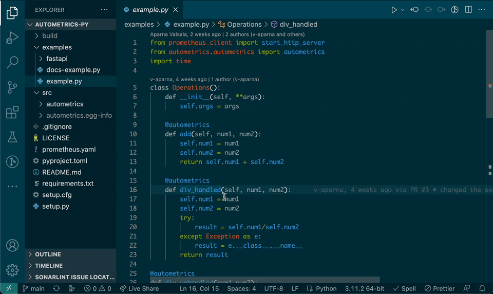

# Autometrics

This extension writes PromQL queries for instrumented functions or methods using
Autometrics libraries.

Currently supported languages:

- [TypeScript](https://www.npmjs.com/package/autometrics)
- [Python](https://pypi.org/project/autometrics/)

More languages will be supported in the future.

## Features

After decorating your code with autometrics, this extension will enrich the
information displayed for a given function on hover.

## Extension Settings

This extension contributes the following settings:

- `autometrics.prometheusUrl`: configure your Prometheus URL. This URL is used
  to create links to your Prometheus including useful autometrics based queries

---

## Developing this extension

This extension is built using:

- [yarn](yarnpkg.com)
- [esbuild](https://github.com/evanw/esbuild) as the bundler

In order to test the extension locally, you may want to install the following
extensions:

- [Rome](https://marketplace.visualstudio.com/items?itemName=rome.rome).
- [esbuild Problem Matchers](https://marketplace.visualstudio.com/items?itemName=connor4312.esbuild-problem-matchers)
  This is needed when vscode to debug the extension.

# How to release a new version

Create a new release using Github which matches the version number it should be
released under.

After tagging and releasing, merge `main` into the `release` branch. (The `release` branch should always reflect the latest released version on VSCode marketplate.)
